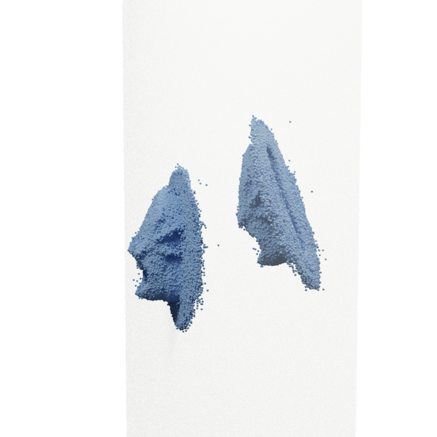
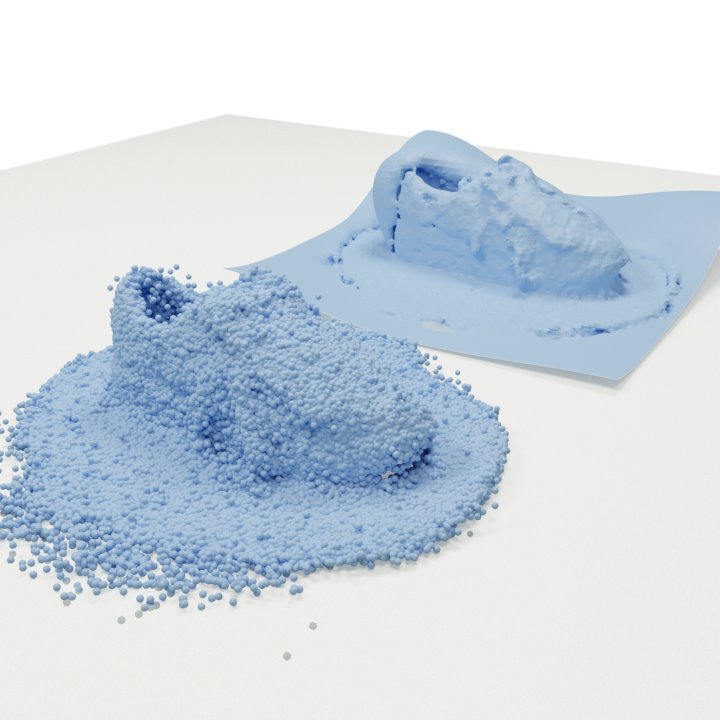

# avtaar_assignment
Avataar Assignment Questions

1. Point Cloud Reorientation

<p align="center">
    
</p>

2. Surface Reconstruction 

<p align="center">
    
</p>


## Requirements

* python==3.9.18
* numpy
* open3d
* scipy


## Point Cloud Reorientation

- Use the following command to reorient the point cloud such that the floor of the point cloud is aligned with the desired axis planes.

```Shell
python process.py --pc_path='./pcs/shoe_pc.ply' --operation='orient' --select_plane='x'
```

- Here the operation choosen is reorientation and the plane selected is x=0 plane (yz plane).


## Surface Reconstruction

- Use the following command to reconstruct the surface of a given point cloud.

```Shell
python process.py --pc_path='./pcs/shoe_pc.ply' --operation='surface' 
```
